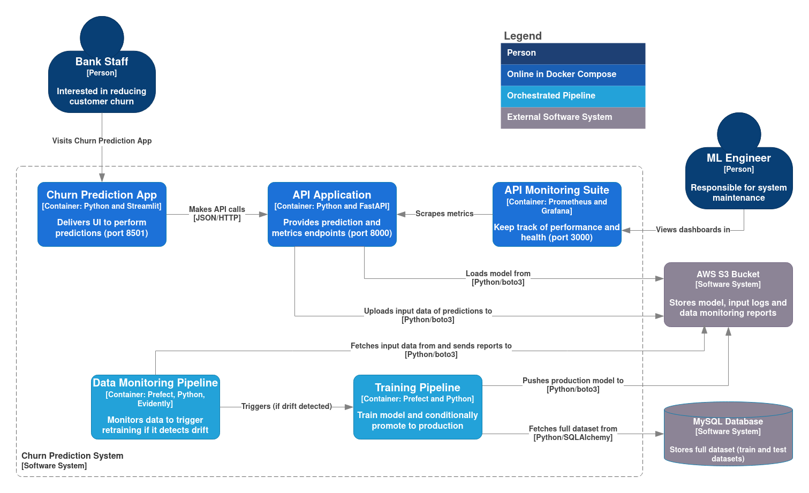
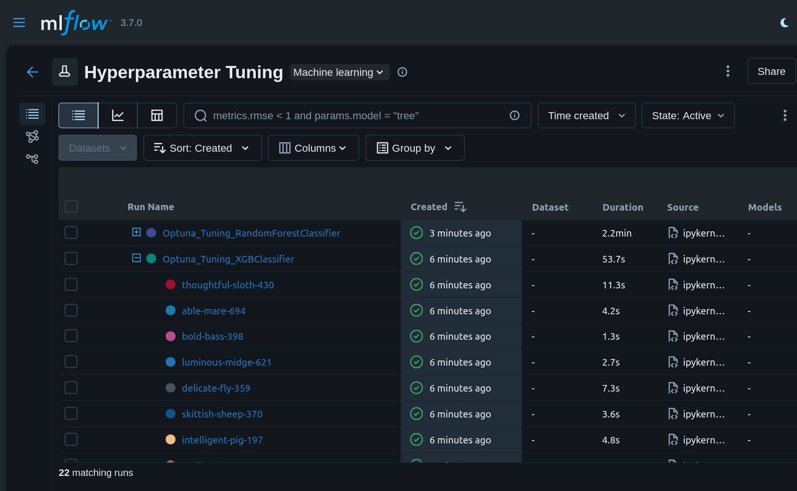
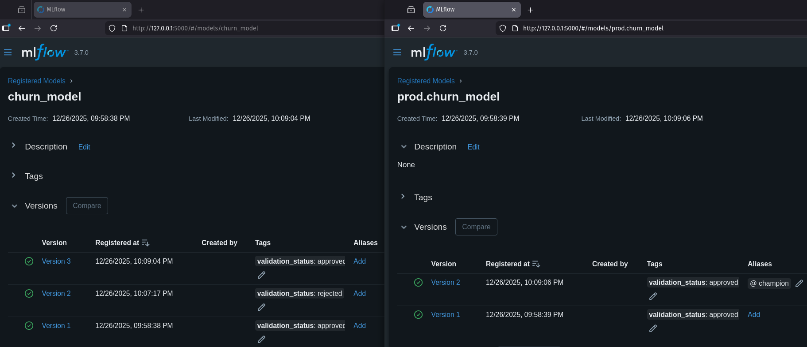
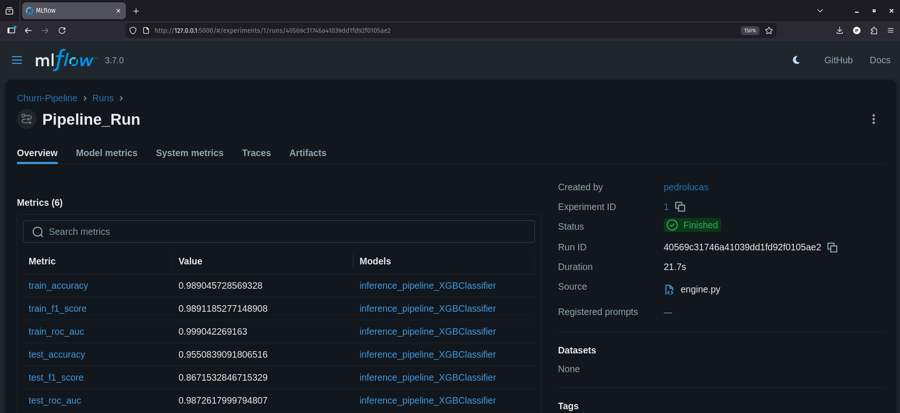
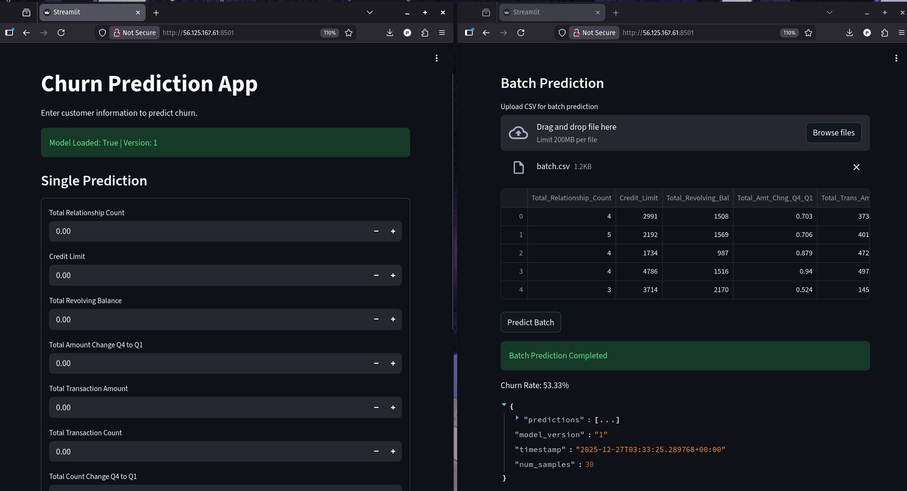
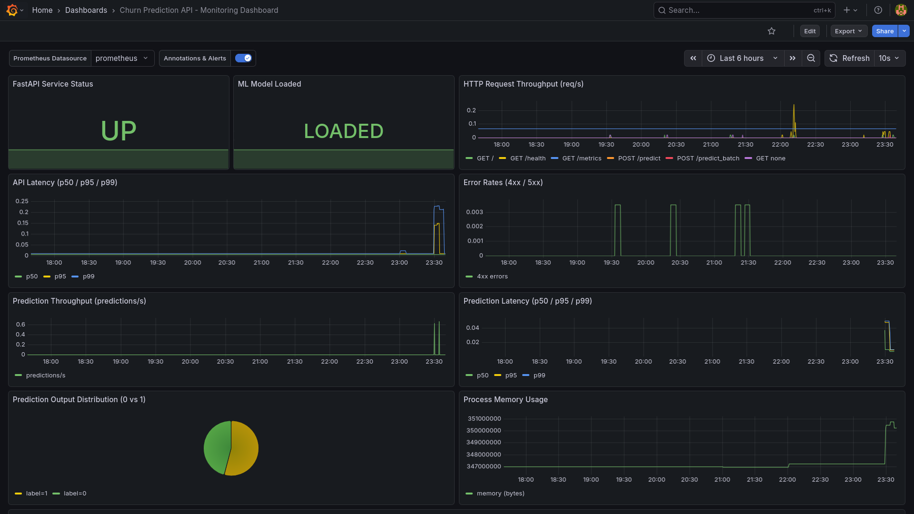
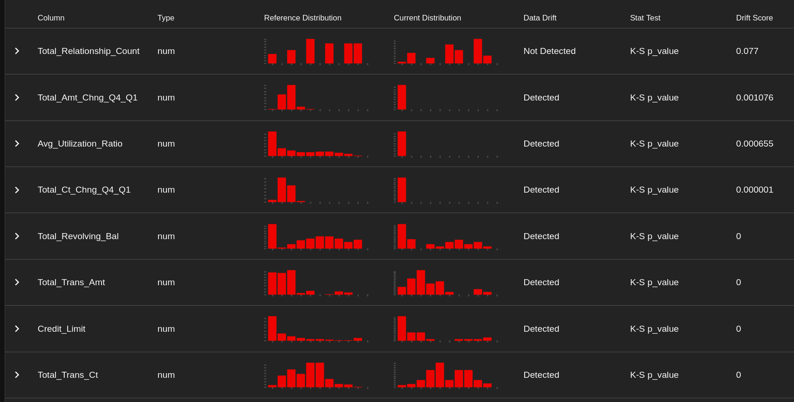
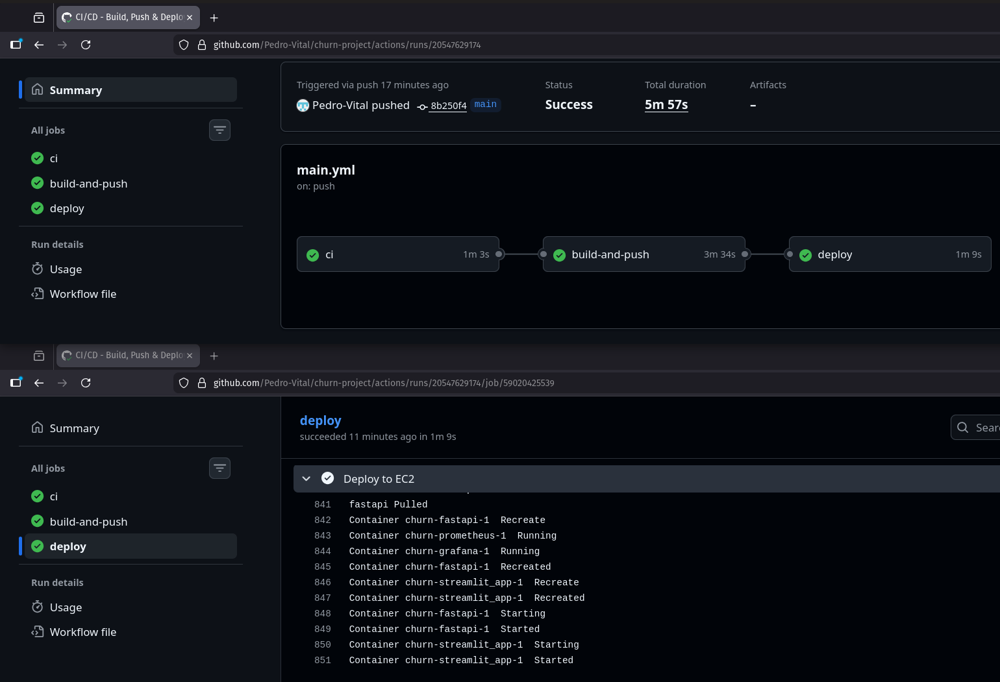
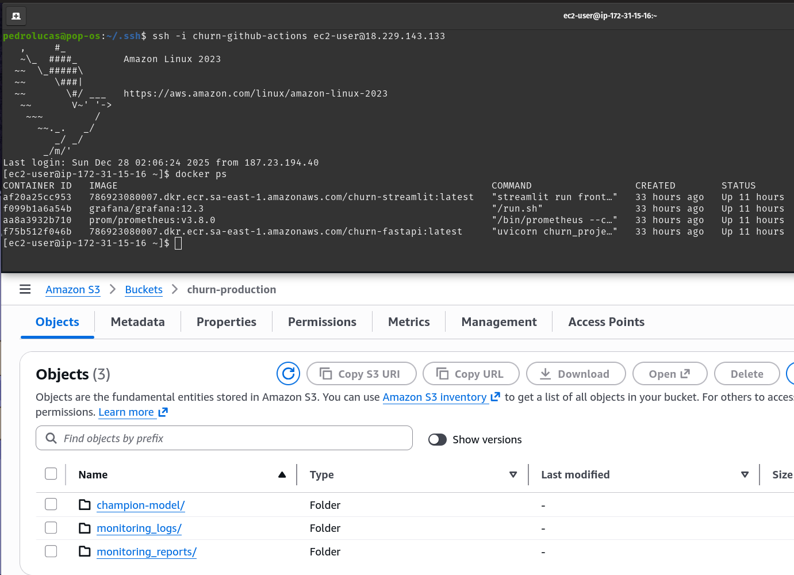

# End-to-End MLops System for Churn Prediction


## Introduction

This repository contains a production-oriented end-to-end ML system for churn prediction in a bank. The project demonstrates core MLOps principles, including orchestration, deployment, model versioning, experiment tracking, monitoring, automated retraining, best practices and much more. The core data science documentation with all the methodology context including exploratory data analysis and modeling is provided in [`research/Experiment.ipynb`](./research/Experiment.ipynb).

---
## Table of Contents

- [Project Overview](#project-overview)
- [System Architecture](#system-architecture)
- [ML Lifecycle Summary](#ml-lifecycle-summary)
- [Sample Run](#sample-run)
- [Limitations & Future Improvements](#limitations--future-improvements)

---
## Project Overview

### Problem Statement

Customer retention plays a critical role in maintaining long-term profitability in the modern banking environment. By predicting which customers are likely to leave in advance, companies can activate retention strategies. This project builds a predictive model to flag potential churners for a bank’s credit card services, enabling the bank to take targeted retention actions.

### High-level solution

This project spans the full machine learning lifecycle, from offline experimentation and hyperparameter optimization to automated training, evaluation, deployment, and monitoring. A training pipeline orchestrates data ingestion, validation, transformation, training, evaluation and promotion to production, while a separate monitoring pipeline continuously evaluates incoming input data for drift and conditionally triggers retraining. Models are versioned, evaluated against the current production baseline, and promoted only when they demonstrate statistically meaningful improvements. Containerized services provide online inference and observability, with CI/CD automation ensuring repeatable builds and controlled deployments, reflecting real-world operational constraints rather than notebook-centric workflows.

**You can check the project structure description in [`docs/project_structure.md`](./docs/project_structure.md)**

**You can check the setup to run the project in [`docs/setup.md`](./docs/setup.md)**

---
## System Architecture

#### System Architecture Diagram



#### 1. Orchestration

**Prefect** is a code-based orchestration tool that acts as the backbone of the training and monitoring workflows.
- The **training pipeline** orchestrates data ingestion, data validation, data transformation, model training, model evaluation and model pushing.
- The **data monitoring pipeline** runs independently. Comparing the new coming data with a reference dataset in a statistical test, the monitoring pipeline triggers the training pipeline when data drift is detected. When the test’s p-value falls below the defined threshold, the null hypothesis is rejected, indicating statistically significant data drift.

Prefect enables scheduled monitoring with deployed flows, which are registered and runnable versions of the pipelines.

#### 2. Experiment Tracking and Model Versioning (MLflow)

- All experiments, metrics, parameters, and model artifacts are tracked in MLflow
- The selected “best” (champion) model is persisted to a dedicated S3 location
- Inference services load models directly from S3.

#### 3. Hyperparameter Tuning

The training pipeline is fed with optimized hyperparameters reached by **Optuna** in the bayesian search performed in the [`experiment notebook`](./research/Experiment.ipynb). MLflow logs a child run at each trial of hyperparameter combination targeting the improvement of a metric value. The best combination is provided in the parent run when the study is finished. The hyperparameters are then passed to the training pipeline configuration in [`config/params.yaml`](./config/params.yaml).


#### 4. Serving & Inference Layer

The serving stack runs on a single **Amazon EC2** instance using Docker Compose.
- **FastAPI** exposes the prediction endpoints
- At application startup, the FastAPI service loads the latest champion model from S3 into memory
- **Streamlit** performs requests, providing a lightweight frontend for interaction and demonstration
- Both services run in isolated **Docker** containers with registered images from **Amazon ECR**.
- The FastAPI service exposes a metrics endpoint that is scraped by **Prometheus** to perform monitoring and alerting.
- **Grafana** is used for the better visualization of metrics.

#### 5. CI/CD & Deployment Strategy

**GitHub Actions** is responsible for continuous integration and deployment:

**CI:**
- Linting and unit tests
- Docker image builds for API and frontend
- Pushes images to Amazon ECR

**CD:**
- Secure SSH connection to the EC2 instance
- Pulls updated images from ECR
- Restarts services via Docker Compose

AWS IAM roles are used instead of long-lived credentials for EC2, aligning with security best practices.

#### Tools Communication Diagram


---

## ML Lifecycle Summary

The system implements a full ML lifecycle in which each stage produces artifacts consumed by downstream steps. Hyperparameters are tuned, frozen and versioned. A training pipeline produces candidate models that are evaluated on an untouched test dataset and compared against the current production model. The automation gates raw data ingestion, schema validation, feature engineering, class imbalance handling, training, evaluation and conditional promotion. Model promotion is gated by a minimum AUC improvement threshold against the current production model, ensuring controlled evolution.

You can check a broader documentation of the ML lifecycle in [`docs/ML_Lifecycle_Design.md`](./docs/ML_Lifecycle_Design.md)

---

## Sample Run

### Hyperparameter Optimization
The [experiment notebook](./research/Experiment.ipynb) is designed to allow for the optimization in two models: XGBoost and Random Forest. The resulting MLflow UI for both tuning runs is shown below.



The image presents both parent runs corresponding to the Optuna's study runs for the two models. Each parent run has its child runs corresponding to the study's trials.

### Training Pipeline 
Run it with:
```bash
python main.py

```
or, if the flow was deployed using prefect:
```bash
prefect deployment run "TrainingPipelineFlow/churn-train"

```
The [`config/config.yaml`](./config/params.yaml) file has two values that can be modified to change the training approach:
- In the "model_trainer" configuration, the model to be trained can be set between "XGBClassifier" and "RandomForestClassifier"
- In the "model_evaluation" configuration, the change threshold value can be defined. This value indicates how much the AUC metric of the new trained model must be greater than the AUC of the old model in production for the new trained model to be accepted as the new production model.

It was performed 3 consecutive runs of the training pipeline in the following pattern:
1. `(model: RandomForestClassifier, threshold: 0.005)`
2. `(model: XGBClassifier, threshold: 0.005)`
3. `(model: XGBClassifier, threshold: 0.000)`

The resulting **MLflow model registry** follows:



- On the left of the image is the "churn_model" registry, where all trained models are registered. The "validation_status" tag indicates whether the model outperformed the model currently in production.
- On the right of the image is the "prod.churn_model" registry, where all the approved models are registered. When a newly trained model outperforms the previous production model, it receives the alias `champion`. The single `champion` model serves predictions.

The following image shows the **MLflow experiment tracking** result for the last run:



### Services

To start the containers locally:
```bash
docker compose up -d
```
In the EC2 instance, containers will be started by CI/CD.

To access services:
| Service | Local | EC2 Instance |
| --- | --- | --- |
| FastAPI | [**`http://localhost:8000/health`**](http://localhost:8000/health) | **`http://<EC2_PUBLIC_IP>:8000/health`** |
| Streamlit | [**`http://localhost:8501`**](http://localhost:8501) | **`http://<EC2_PUBLIC_IP>:8501`** |
| Prometheus | [**`http://localhost:9090`**](http://localhost:9090) | **`http://<EC2_PUBLIC_IP>:9090`** |
| Grafana | [**`http://localhost:3000`**](http://localhost:3000) | **`http://<EC2_PUBLIC_IP>:3000`** |

#### Streamlit



Streamlit performs requests for the both *post* endpoints of **FastAPI**: single prediction and batch prediction.

#### Grafana



Grafana has **Prometheus** as data source. To set the Grafana dashboard, check [`docs/grafana_dashboard.md`](./docs/grafana_dashboard.md).

### Data Monitoring Pipeline

Scheduled monitoring can be set in **[`Prefect UI`](http://127.0.0.1:4200) → Deployments → monitoring → Schedule** or run it manually with:  
```bash
prefect deployment run "DataMonitoringFlow/monitoring" \
  --params '{
    "date": "YYYY-MM-DD",
    "threshold": 0.05
  }'

```
*`Replace YYYY-MM-DD with the date on which you want to monitor the input data (e.g. 2026-01-23).`*\
*`If monitoring is scheduled, the pipeline performs drift detection in the data from the scheduled date.`*

- *To simplify the approach, monitoring takes into account only the data of a single date (**UTC**) on which predictions were performed.*

The following image from the **Prefect UI** shows the temporal sequence of tasks performed by monitoring + triggered retraining.


The resulting **Evidently** report follows:



### CI/CD



Containers up in the **EC2 Instance** and resulting **S3 Bucket**:



---

## Limitations & Future Improvements

**This section highlights *the main* limitations of the current system to clarify design trade-offs and guide future improvements.**

### Data, Monitoring, and Retraining Limitations (Most Critical)
- **Retraining does not leverage drifted data distributions:**
When data drift is detected, retraining currently reuses the original training and test datasets sourced from MySQL. As a result, the newly trained model is not exposed to the shifted data distribution that triggered retraining, limiting the effectiveness of automated adaptation.

- **Lack of explicit data lineage across the ML lifecycle:**
Monitoring, retraining, and models are not yet linked through explicit data lineage. While drift detection triggers retraining, there is no guaranteed traceability between prediction logs, the data used for retraining, and the resulting model version.

- **Reference data is static and not versioned per model:**
The monitoring pipeline relies on a single reference dataset. There is currently no mechanism to maintain reference data aligned with each production model version, which may reduce the accuracy of drift detection after multiple deployments.

- **Drift detection is based on single-day snapshots:**
Data drift detection is performed on a per-day snapshot of prediction data. This approach is sensitive to short-term fluctuations and does not capture longer-term distributional trends, increasing the risk of false-positive retraining triggers.

- **Overly sensitive retraining trigger logic:**
Retraining is triggered as soon as any single feature is detected as drifted, with no minimum number of drifted features or cooldown mechanism. This can lead to unnecessary retraining cycles caused by transient or low-impact distribution changes.

- **Prediction logs are stored as individual S3 objects:**
Each prediction request is logged as a separate JSON object in S3. While simple and transparent, this approach does not scale efficiently and complicates downstream aggregation, querying, and dataset construction for retraining.

### Model Deployment

- **Model updates require API restart or redeployment:**
The prediction API loads the production model at application startup. Newly promoted models are therefore not detected automatically, requiring a service restart or redeployment to serve updated models.
